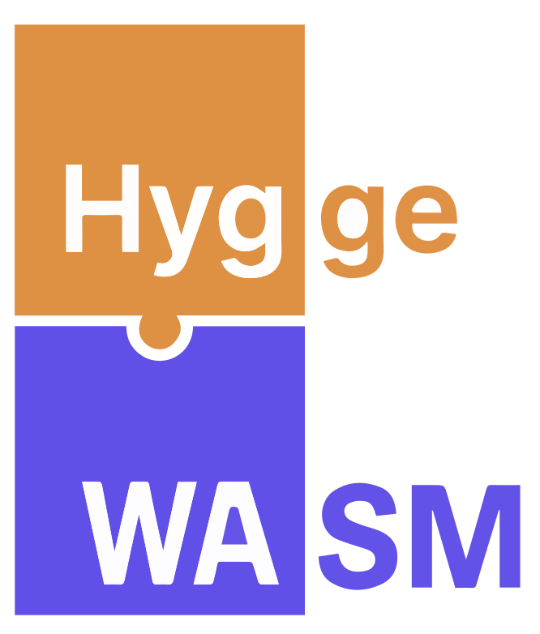
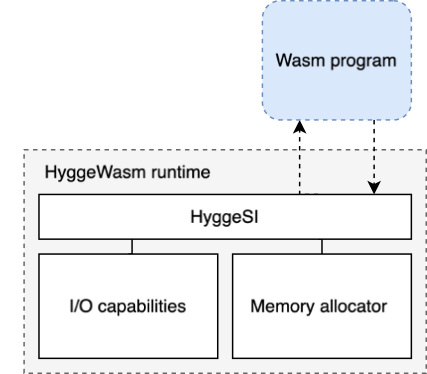
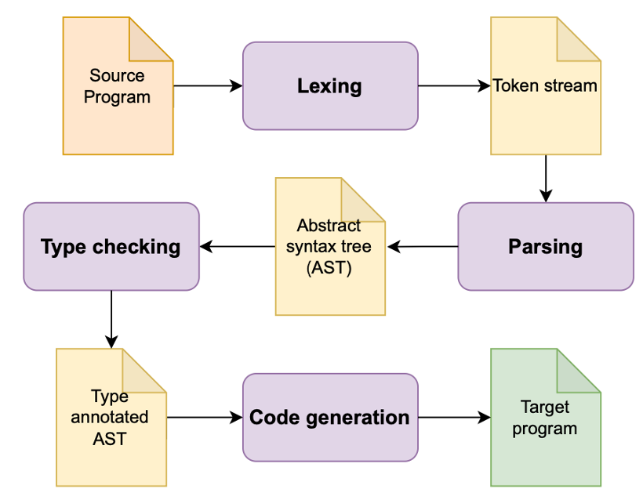
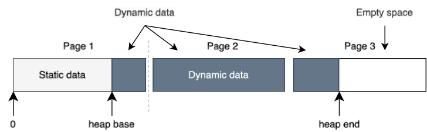

# HyggeWasm - The Hygge to WebAssembly compiler

This is the source code of the `HyggeWasm` compiler. `HyggeWasm` is a WebAssembly compiler for the Hygge programming language. The compiler produces the WebAssembly textual format (WAT) as its output. `HyggeWasm` has been developed as part of the master thesis "Design and Implementation of a WebAssembly Compiler Back-End for the High-Level Programming Language Hygge" by Troels Lund at Technical University of Denmark. (DTU). A list of all language features implemented can be found in the section [Language features](#language-features---requirements).

The `HyggeWasm` compiler is based on `hyggec` and uses the Hygge programming language as the the *source language*. `hyggec` and Hygge programming language was created by Alceste Scalas at DTU.



## Software Requirements

* .NET 8.0 (for compiling and running `HyggeWasm`)
  * On Ubuntu and Debian GNU/Linux: `apt install dotnet8`
  * On MacOS: `brew install dotnet@8`
  * On Windows: <https://dotnet.microsoft.com/en-us/download>

## Useful tools

* [WABT](https://github.com/WebAssembly/wabt)
* [wasm-tools](https://github.com/bytecodealliance/wasm-tools)
* [WasmTime](https://docs.wasmtime.dev/cli-install.html)

## Examples

The folder *examples/hygge* contain a variety of example Hygge programs.

Futhermore can programs found in the *tests* be used for inspiration.

## Quick Start

After installing the required software above, open a terminal in the root
directory of the `HyggeWasm` source tree, and try:

```
./hyggec test
```

This command automatically builds `HyggeWasm` and runs its test suite. If you don't
see any error, then `HyggeWasm` was built correctly and passed all its tests.  You
should now be able to use and modify it.

To see the usage options, you can execute:

```
./hyggec help
```

You will see a list of various commands.  To get usage options for a specific
command (for example, `compile`):

```
./hyggec compile --help
```

Here's something you can try:

```
./hyggec interpret --typecheck --verbose examples/hygge0-spec-example.hyg
```

## Building `HyggeWasm` from the Command Line

Every time you invoke the script `./hyggec`, the compiler will be rebuilt if its
source code was modified since the last execution.

You can also (re)build the `HyggeWasm` executable by running:

```
dotnet build
```

To clean up the results of a build, you can run:

```
dotnet clean
```

## Recommended Visual Studio Code Extensions

These Visual Studio Code extensions are very helpful when working on `HyggeWasm`:

* [Ionide for F#](https://marketplace.visualstudio.com/items?itemName=Ionide.Ionide-fsharp)
* [FSharp fsl and fsy](https://marketplace.visualstudio.com/items?itemName=mnxn.fsharp-fsl-fsy)
* [WebAssembly](https://marketplace.visualstudio.com/items?itemName=dtsvet.vscode-wasm)

# Use of the CLI

## Run test suite

The CLI lets the user run the test suite.

    ./hyggec test

## Compile Hygge program

    ./hyggec <path to hygge program> -s l -o <path to wat output file> -e -i 0 -m 1

| Flag | Description               | Input's                                           |
|------|---------------------------|---------------------------------------------------|
| _    | Input                     | path to hygge program                             |
| -s   | Writring style            | linar ("l") or folded ("f")                       |
| -o   | Output file               | Path to wat output file                           |
| -i   | System interface          | 0 - HyggeSI or 1 - WASI                           |
| -m   | Memory mode               | 0 - External or 1 - Internal or 2 - Heap (WasmGC) |
| -e   | Execute after compilation| _                                                 |

## Run .wat file standalone

The CLI lets the user run the ’.wat’-file with WasmTime and the HyggeWasm runtime.

    ./hyggec wasm test.wat

# Input/Output

Programs can use either WASI or the Hygge System Interface for I/O.



# Architecture

Overview of the compiler phases:



Phases of the code generation:


# Memory

Memory can be will be grown at **runtime** when using the *internal* and *external* modes.


# Language features - Requirements

## Must Have

* The generated code must be a valid WAT module. ✅

* The developer must be able to add a comment to every instruction. ✅
* The generated code must be formatted in a reasonable and readable way. ✅
* The generated code must have only one entry point of execution (One main function) that will be implicit and therefore invisible for the Hygge
programmer. ✅
* The backend must be able to produce functional WAT pertaining to the subsequent language features and operators:
  * Arithmetic operators ✅
    * Subtraction ✅
    * Addition ✅
    * Remainder division (Modulo) ✅
    * Division ✅
    * Square root ✅
    * Maximum and minimum between two numbers ✅
  * Relational operators ✅
    * Equality ✅
    * Less than ✅
    * Less than or equal ✅
    * Greater than ✅
    * Greater than or equal ✅
  * Variables ✅
    * Immutable Variables ✅
    * Mutable Variables ✅
    * Pre- and post-increment and decrement operators ( ++var, var-- ) ✅
    * Addition assignment ( var1 += 1 ) ✅
    * Subtraction assignment ( var2 -= 1 ) ✅
    * Multiplication assignment ( var1 *= 1 ) ✅
    * Division assignment ( var1 /= 1 ) ✅
    * Remainder division assignment ( var1 %= 1 ) ✅
  * Logical operators ✅
    * Exclusive or (Xor) ✅
    * Or ✅
    * And ✅
    * Short-circuiting: ✅
      * And ( && ) ✅
      * Or ( || ) ✅
  * Control flow ✅
    * Conditional statements (if-then-else) ✅
    * While-loops ✅
    * For-Loops ✅
    * Do-while-loops ✅
  * Data structures and operations ✅
    * Structs - Constructor, Access field. Assign field value. ✅
    * Tuples - Constructor, Access field. Assign field value. ✅
    * Arrays - Constructor, Access element, Assign element value, Slice Array. ✅
  * Functions ✅
    * Functions as first-class citizens ✅
    * Recursive functions declarations ✅
    * Recursive functions calls ✅
    * Anonymous functions ✅
    * Closures ✅
    * Closures with shared mutable variables ✅
  * Data types ✅
    * Integer values ✅
    * Floating-point values ✅
    * Strings ✅
      * String length - Can obtain the length of a string with a pointer to the string data.
  * I/O ✅
    * Read integer or float values into module. ✅
    * Write integer, float, and string values value to output stream ✅
  * Test specific features ✅
    * Assert operator that will end the program or continue execution based on a boolean expression. ✅

## Should Have

* The developer should be able to add line comments without a companion instruction. ✅

* The backend should be able to produce functional WAT pertaining to the subsequent language features and operators: ✅
  * Typing and Pattern matching ✅
    * Discriminated Union Types ✅
    * Pattern matching ✅

## Could Have

* The compiler could use optimization techniques such as peephole optimization. ✅

* The generated code could generate code in both a flat and nested (Folded) writing style based on input arguments. ✅
* The Hygge language could be extended to let the Hygge programmer explicitly add exports of functions. ✅

## Won't Have (this time)

* Be able to throw and handle exceptions ❌

* Have explicit main function declaration ❌

# Example Hygge programs

### Print to console

```hyg
println("Hello, World!")
```

### Compute term of the Fibonacci sequence

```hyg
let n: int = readInt(); // read the input
// define a recursive function to calculate the nth term of the Fibonacci sequence
fun fibRec(n: int): int = { 
    if (n <= 1) then {
        n
    } 
    else {
        fibRec(n - 1) + fibRec(n - 2)
    }
};
// print the result
println("The term of the Fibonacci sequence is:");
println(fibRec(n))
```

### loops

```hyg
let mutable x: int = 0;
let mutable y: int = 0;

do {
    x <- x + 1;
    y <- y + 1
} while (not (x + y = 42));

assert(x + y = 42)
```

### Closure to capture counter state

```hyg
fun makeCounter(y: int): () -> int = {
    let mutable x: int = 2;
    fun () -> {
        x <- x * y // x is captured from the surrounding scope
    }
};

let c1: () -> int = makeCounter(2);
let c2: () -> int = makeCounter(4);
let c3: () -> int = makeCounter(8);

assert(c1() = 4);
assert(c1() = 8);
assert(c2() = 8);
assert(c3() = 16);
assert(c3() = 128)
```

### Quick sort

```hyg
fun partition (arr: array{int}, low: int, high: int): int = {
    // Choose the rightmost element as the pivot
    let pivot: int = arrayElem(arr, high);

    // Index of the smaller element
    let mutable i: int = low - 1;
    let mutable j: int = 0;

    for (j <- low; j < high; j++) {
        // If the current element is smaller than or equal to the pivot
        if (arrayElem(arr, j) <= pivot) 
        then {
            // Swap arr[i] and arr[j]
            i <- i + 1;
            let temp: int = arrayElem(arr, i);
            arrayElem(arr, i) <- arrayElem(arr, j);
            arrayElem(arr, j) <- temp;
            ()
        }
        else {()}
    };

    // Swap arr[i+1] and arr[high] (pivot)
    let temp: int = arrayElem(arr, i + 1);
    arrayElem(arr, i + 1) <- arrayElem(arr, high);
    arrayElem(arr, high) <- temp;

    // Return the pivot index
    i + 1
};

fun quickSort(arr: array{int}, low: int, high: int): unit = {
    if (low < high)
    then {
        // Partition the array and get the pivot index
        let pivotIndex: int = partition(arr, low, high);

        // Recursively sort the subarrays on both sides of the pivot
        quickSort(arr, low, pivotIndex - 1);
        quickSort(arr, pivotIndex + 1, high);
        ()
    }
    else {()}
};
```
